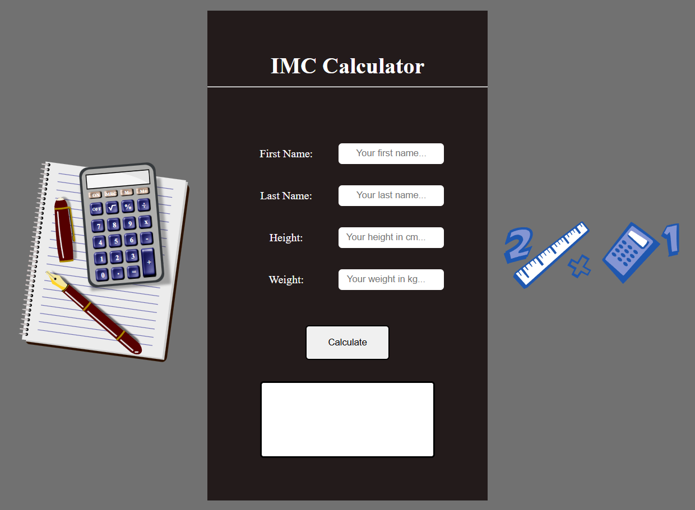

 
  
  
   

 

<!-- PROJECT -->

  <h3 align="center">BmiCalculator</h3>

  

    BMI (Body Mass Index) calculator to identify if a person is within their ideal weight range.
  

  

    <a href="#about-the-project"><strong>Explore the docs »</strong></a>
  
  

     
    <a href="#usage">View Demo</a>
  

<!-- TABLE OF CONTENTS -->

  
Table of Contents

  <ol>
    <li>
      <a href="#about-the-project">About The Project</a>
      <ul>
        <li><a href="#built-with">Built With</a></li>
      </ul>
    </li>
    <li>
      <a href="#getting-started">Getting Started</a>
      <ul>
        <li><a href="#prerequisites">Prerequisites</a></li>
      </ul>
    </li>
    <li><a href="#usage">Usage</a></li>
    <li><a href="#license">License</a></li>
  </ol>

<!-- ABOUT THE PROJECT -->
## About The Project

BMI (Body Mass Index) calculator to quickly and easily assess the relationship between weight and height, helping to identify if a person is within their ideal weight range.

Main Objectives:

* Provide a practical tool to calculate BMI.
* Support decision-making related to health.

 

### Built With

 

(<a href="#readme-top">Back to top</a>)

 

<!-- GETTING STARTED -->
## Getting Started

Instructions on how you can set up your project locally.

### Prerequisites

* Git: To clone the repository.
* Node.js and npm/yarn: Required for front-end development.
* Web Browser: Any modern browser like Google Chrome, Firefox, Edge, or Safari.
* Code Editor: To view and edit the source code, such as Visual Studio Code.

 

(<a href="#readme-top">Back to top</a>)

 

<!-- USAGE -->
## Usage

Demonstration of how the project can be used

**1. Filling in your information**

* You must fill in information such as first name, last name, weight and height and then click on the calculate button

 

(<a href="#readme-top">Back to top</a>)

 

## License

This project is under [MIT](/LICENSE)
